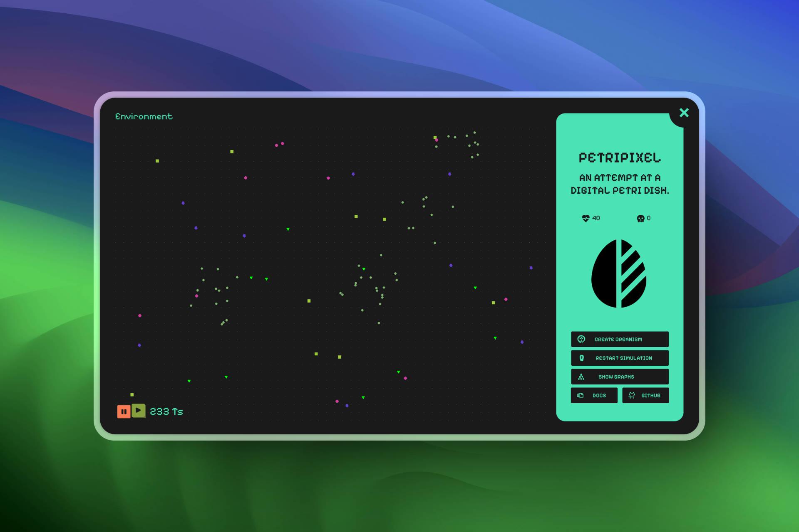
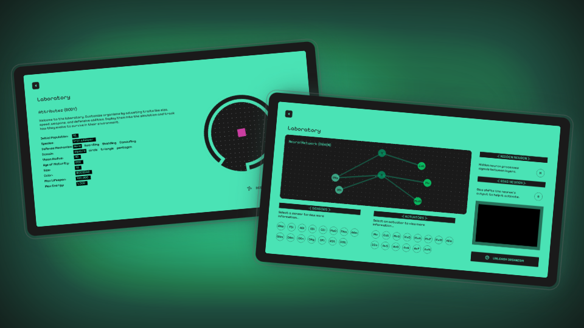

# **PetriPixel**

Inspired by the works of [@PrimerBlobs](https://www.youtube.com/@PrimerBlobs), [@davidrandallmiller](https://www.youtube.com/@davidrandallmiller), and [@Green-Code](https://www.youtube.com/@Green-Code), especially their videos on [Natural Selection](https://youtu.be/0ZGbIKd0XrM), [Evolution](https://youtu.be/N3tRFayqVtk), and [Neural Networks](https://youtu.be/cAkMcPfY_Ns), I’ve wanted to build something like this for a long time. My BTech final project felt like the perfect excuse to finally do it.

So, here’s **PetriPixel**—a digital petri dish where you can create organisms by customizing their **phenotypic and genotypic traits** (like neural networks, size, color, and defense mechanisms) and release them into an environment to see how they interact. This is just the first iteration, and there’s a lot more I want to refine and expand.

# Key Features

-   Create Various Creatures
    -   Design their physical traits
    -   Design their behavioral traits
-   Observe how they interact with each other
-   Watch theme evolve