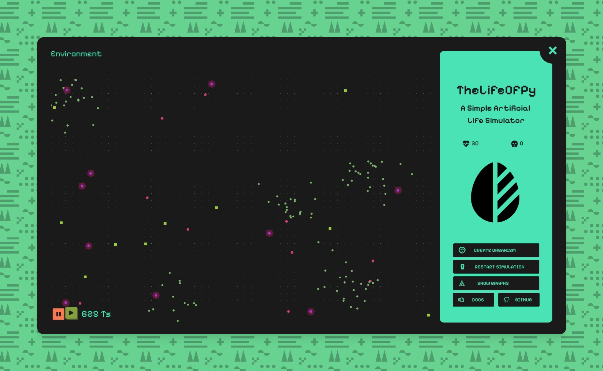
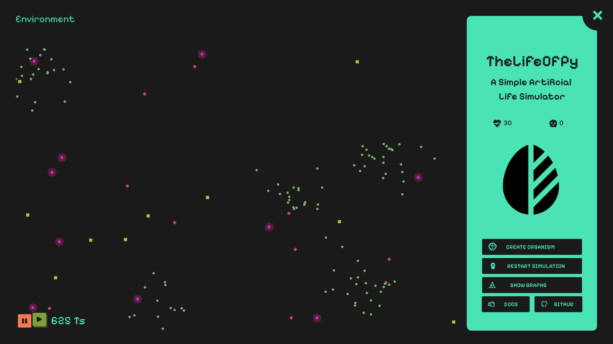

# PetriPixel



Inspired by the works of [@PrimerBlobs](https://www.youtube.com/@PrimerBlobs), [@davidrandallmiller](https://www.youtube.com/@davidrandallmiller), and [@3Blue1Brown](https://www.youtube.com/@3Blue1Brown), I’ve wanted to build something like this for a long time My BTech final project felt like the perfect excuse to finally do it.

So, here’s **PetriPixel**—my attempt at creating a digital petri dish where you can create organisms by customizing their **phenotypic and genotypic traits** (like neural networks, size, color, and defense mechanisms) and release them into an environment to see how they interact.

P.S. If you liked the project, a ⭐ would mean a lot.

## Key Features


-   **Create Various Creatures** 

    -   Define their physical traits—size, shape, and defensive features.
    -   Set their behavioral traits—how they respond to food, threats, and each other.

-   **Observe Their Interactions**

    -   See how they navigate their environment, whether they compete, cooperate, or simply coexist.

-   **Watch Them Evolve**
    -   Over generations, successful traits persist while others disappear, shaping the next wave of creatures.

## Requirements

- Display: 1920×1080 resolution
- Python: 3.x
- Operating System: Tested on Windows and Linux
- Dependencies (if running from source): See requirements.txt (also requires Visual C++ Build Tools on Windows)
- RAM: Minimum 4 GB (8 GB recommended)

## Installation & Setup

### 📥 **Get the Latest Release (Recommended)**

For the easiest setup, download the latest standalone runner from the **[Releases](https://github.com/MZaFaRM/PetriPixel/releases/)** section. No additional installation is required—just run the executable!

### 🛠 **Run from Source**

If you want to run the project from source, follow these steps:

#### **1. Install Prerequisites**

-   **Python** (>= 3.x) – [Download here](https://www.python.org/downloads/)

> **Windows Users:** If you encounter errors during installation, install [Visual Studio C++ Build Tools](https://visualstudio.microsoft.com/visual-cpp-build-tools/) and ensure you select **"Desktop development with C++"** during installation.

#### **2. Clone the Repository**

```bash
git clone https://github.com/MZaFaRM/PetriPixel.git
cd PetriPixel
```

#### **3. Create & Activate a Virtual Environment (Optional but Recommended)**

```bash
python -m venv venv
source venv/bin/activate  # On macOS/Linux
venv\Scripts\activate      # On Windows
```

#### **4. Install Dependencies**

Before proceeding, ensure `pip`, `setuptools`, and `wheel` are up to date:

```bash
pip install --upgrade pip setuptools wheel
```

Now, install the required dependencies:

```bash
pip install -r requirements.txt
```

#### **5. Run the Project**

```bash
python main.py
```

## Guides & Wiki

Check out the project [wiki](https://github.com/MZaFaRM/PetriPixel/wiki).

## Video

<p align="center">
  <a href="https://youtu.be/h_OTqW3HPX8">
    
  </a>
</p>

## References

>   **"Simulating Natural Selection"** – _Primer Blobs_ ([YouTube](https://youtu.be/0ZGbIKd0XrM))  

Gave me inspiration for the project itself.
>   **"I programmed some creatures. They Evolved."** – _David Randall Miller_ ([YouTube](https://youtu.be/N3tRFayqVtk))  

Gave me ideas on how to implement the neural network aspects.
>   **"Neural Networks"** – _3Blue1Brown_ ([YouTube](https://youtube.com/playlist?list=PLZHQObOWTQDNU6R1_67000Dx_ZCJB-3pi&si=n2Z-eqO5R8f-HR5O))
    
Taught me a good chunk about building Neural Networks.

## License

This project is licensed under the **MIT License**. See the full license text [here](LICENSE).

---
